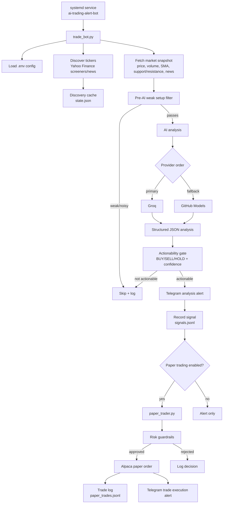
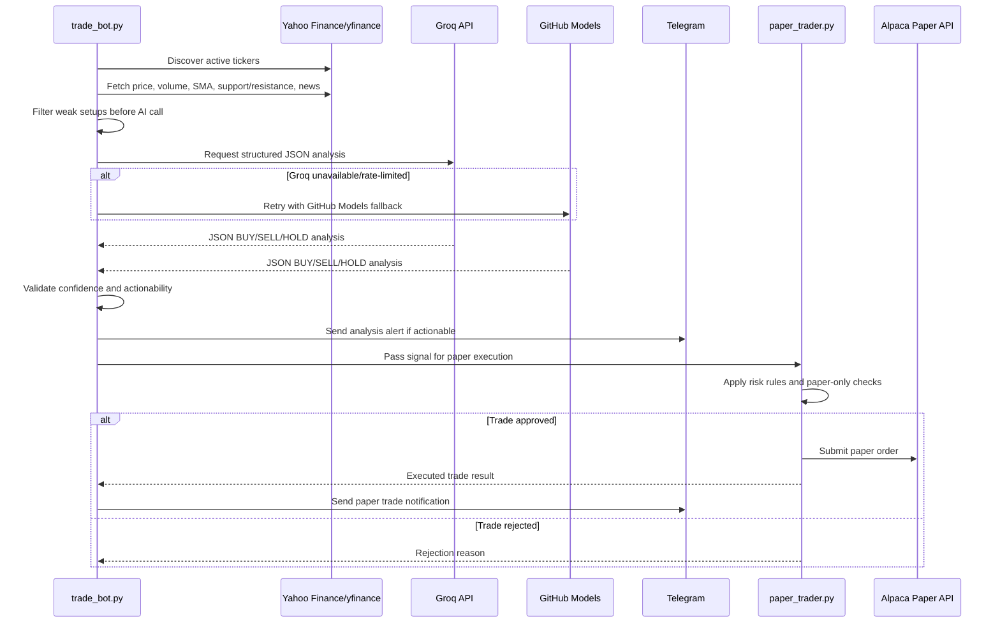
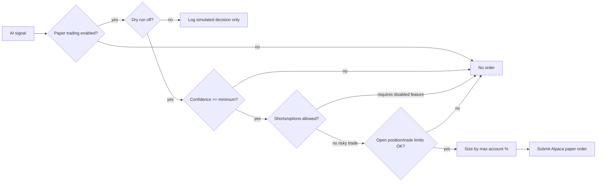
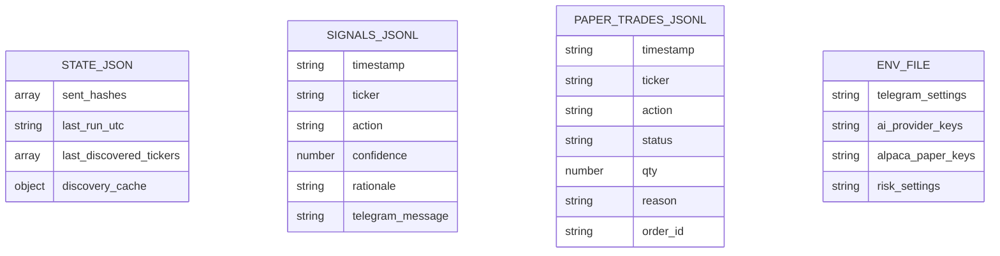

# AI Trading Alert Bot

An always-on Python trading assistant that discovers active stock tickers, enriches them with market context, asks an AI model for structured trade analysis, sends actionable Telegram alerts, and can optionally place **Alpaca paper-trading** orders under guardrails.

> This project is for research, alerts, and paper-trading automation. It is **not financial advice** and should not be used for live trading without independent review and stronger risk controls.

## Current capabilities

- Dynamically discovers symbols from Yahoo Finance:
  - day gainers
  - most active stocks
  - trending/news-related tickers
- Pulls recent price action, volume, moving averages, support/resistance, and headlines with `yfinance`.
- Pre-filters weak setups before spending AI tokens.
- Uses AI provider fallback:
  - Groq first
  - GitHub Models fallback when configured
- Requires structured JSON from the model instead of loose free-form text.
- Applies stricter BUY/SELL/HOLD gating before sending Telegram alerts.
- Sends Telegram analysis alerts only for actionable signals.
- Records signals to `signals.jsonl`.
- Optionally places Alpaca **paper** orders through `paper_trader.py`.
- Sends a second Telegram notification when a paper buy is executed, including quantity, order type, take-profit, stop-loss, confidence, and rationale.
- Uses `state.json` to prevent duplicate alerts and cache discovered tickers.
- Runs continuously as a Linux `systemd` service.

## High-level architecture



## AI analysis workflow



## Paper-trading guardrails

Paper trading is intentionally conservative by default. The bot can be configured to hold many paper positions, but it still respects risk controls.



Default safety posture:

- Paper trading only unless the code/config is deliberately changed.
- `PAPER_TRADING_DRY_RUN=true` by default.
- Minimum confidence defaults to `75`.
- Shorts disabled by default.
- Options disabled by default.
- Max position size defaults to `10%` of paper account equity/cash.
- Daily trade limits remain configurable.

## Data files



Runtime/private files are ignored by Git and should not be committed:

- `.env`
- `.env.bak.*`
- `state.json`
- `signals.jsonl`
- `paper_trades.jsonl`
- logs, databases, key files, and backups

## Requirements

- Python 3.10+
- Telegram bot token and chat ID
- Groq API key
- Optional GitHub Models token for fallback
- Optional Alpaca paper-trading API credentials
- Linux/systemd if running as a service

## Setup

```bash
git clone https://github.com/D1nggDong/trading-bot.git
cd trading-bot
python3 -m venv venv
source venv/bin/activate
pip install -r requirements.txt
cp .env.example .env
```

Then edit `.env` with your credentials and settings.

## Environment variables

### Telegram

| Variable | Required | Purpose |
|---|---:|---|
| `TELEGRAM_BOT_TOKEN` | Yes | Telegram bot token |
| `TELEGRAM_CHAT_ID` | Yes | Destination chat/channel ID |

### AI providers

| Variable | Required | Default | Purpose |
|---|---:|---|---|
| `AI_PROVIDER_ORDER` | No | `groq,github` | Provider priority order |
| `GROQ_API_KEY` | Yes | - | Groq API key |
| `MODEL_NAME` | No | `llama-3.3-70b-versatile` | Groq model |
| `GITHUB_MODELS_TOKEN` | No | - | Enables GitHub Models fallback |
| `GITHUB_MODELS_BASE_URL` | No | `https://models.github.ai/inference` | GitHub Models endpoint |
| `GITHUB_MODELS_MODEL` | No | `openai/gpt-4.1-mini` | GitHub fallback model |

### Discovery and market data

| Variable | Default | Purpose |
|---|---|---|
| `CHECK_INTERVAL_MINUTES` | `60` | Run interval, minimum 5 minutes |
| `NEWS_LOOKBACK_DAYS` | `7` | News freshness window |
| `MAX_NEWS_ITEMS` | `5` | Max headlines per ticker |
| `DAY_GAINERS_LIMIT` | `10` | Symbols from day gainers screener |
| `MOST_ACTIVE_LIMIT` | `10` | Symbols from most active screener |
| `TRENDING_NEWS_LIMIT` | `25` | News items scanned for related tickers |
| `DISCOVERY_REGION` | `US` | Yahoo trending region |
| `DISCOVERY_CACHE_MINUTES` | `360` | Reuse ticker discovery cache to reduce API pressure |
| `MAX_AI_CANDIDATES` | `3` | Max candidates sent to AI per cycle |
| `MIN_SIGNAL_PRICE_CHANGE_PCT` | `1.0` | Pre-AI movement threshold |
| `MIN_SIGNAL_RELATIVE_VOLUME` | `1.2` | Pre-AI relative volume threshold |
| `REQUEST_TIMEOUT_SECONDS` | `12` | HTTP request timeout |
| `MAX_PARALLEL_TICKERS` | `1` | Reserved concurrency tuning |

### Paper trading

| Variable | Default | Purpose |
|---|---|---|
| `PAPER_TRADING_ENABLED` | `false` | Enables paper-trading module |
| `PAPER_TRADING_DRY_RUN` | `true` | If true, logs decisions but does not place orders |
| `PAPER_MIN_CONFIDENCE` | `75` | Minimum confidence needed for paper order |
| `PAPER_MAX_OPEN_POSITIONS` | `3` | Max open paper positions. Use high value like `999` for effectively unlimited |
| `PAPER_MAX_POSITIONS` | `3` | Backward-compatible alias for max open paper positions |
| `PAPER_MAX_POSITION_PCT` | `10.0` | Max percent of paper account per position |
| `PAPER_MAX_TRADES_PER_DAY` | `3` | Max paper trades per day |
| `PAPER_MAX_TRADES_PER_TICKER_PER_DAY` | `1` | Max paper trades per ticker per day |
| `PAPER_ALLOW_SHORTS` | `false` | Allows short selling if explicitly enabled |
| `PAPER_ALLOW_OPTIONS` | `false` | Allows options if explicitly enabled |
| `PAPER_SIGNAL_FILE` | `signals.jsonl` | Signal record file |
| `PAPER_TRADE_LOG` | `paper_trades.jsonl` | Paper trade log file |
| `ALPACA_API_KEY` | - | Alpaca paper API key |
| `ALPACA_SECRET_KEY` | - | Alpaca paper secret key |
| `ALPACA_BASE_URL` | Alpaca paper URL | Alpaca endpoint; keep paper URL for paper trading |

### Runtime

| Variable | Default | Purpose |
|---|---|---|
| `LOG_LEVEL` | `INFO` | Logging verbosity |
| `STATE_FILE` | `state.json` | Persistent dedupe/cache state |
| `TIMEZONE` | `UTC` | Runtime timezone setting |

## Run locally

```bash
python trade_bot.py
```

The bot runs continuously and sleeps between cycles based on `CHECK_INTERVAL_MINUTES`.

## Run as a systemd service

The included helper script installs `ai-trading-alert-bot.service` for the Raspberry Pi deployment path:

```bash
chmod +x setup_service.sh
./setup_service.sh
```

Current deployment assumptions:

- Bot directory: `/home/dingg/Tradingbot`
- Virtualenv Python: `/home/dingg/Tradingbot/venv/bin/python3`
- Environment file: `/home/dingg/Tradingbot/.env`
- Service name: `ai-trading-alert-bot.service`

Useful service commands:

```bash
sudo systemctl restart ai-trading-alert-bot.service
systemctl --no-pager --plain is-active ai-trading-alert-bot.service
journalctl -u ai-trading-alert-bot.service -f
```

## Telegram alerts

The bot sends two categories of Telegram messages:

1. **Analysis alert** — sent when the AI finds an actionable BUY/SELL setup.
2. **Paper trade execution alert** — sent when the paper trader actually places a paper order.

Paper buy notifications include:

- ticker
- quantity
- order type
- take-profit
- stop-loss
- confidence
- rationale/reason
- paper-trade-only note

## Development safety checklist before pushing

Before pushing public changes, verify:

```bash
git status --short
git diff --check
python3 -m py_compile trade_bot.py paper_trader.py
git check-ignore -v .env signals.jsonl paper_trades.jsonl
```

Never commit real `.env` files, API keys, Telegram tokens, Alpaca credentials, logs, or trade history files.

## Disclaimer

This bot can generate alerts and place paper trades. It does not guarantee profitable decisions. Always validate results independently, monitor risk, and keep real-money execution disabled unless you intentionally build and review a production-grade trading system.
